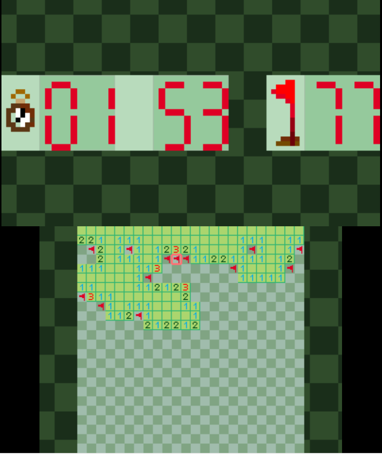
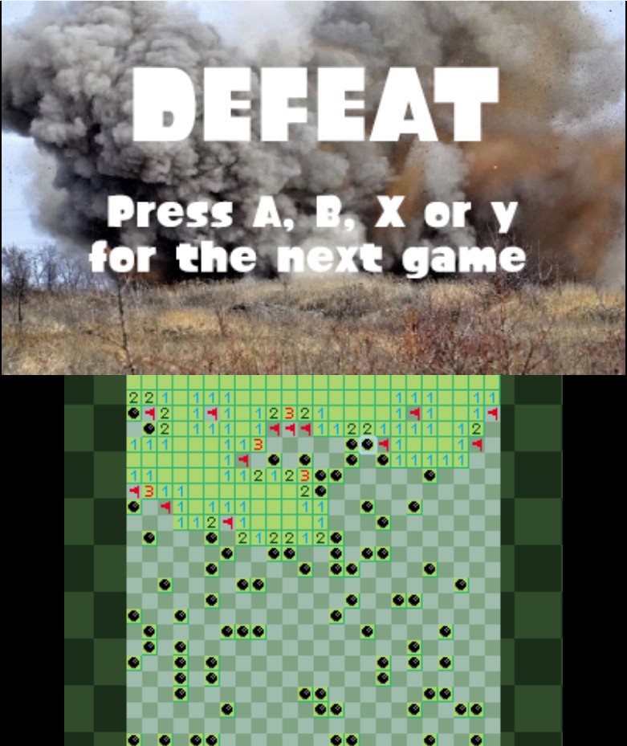

# Mine Sweeper for Nintendo 3DS

A classic Minesweeper game developed for the Nintendo 3DS homebrew scene. This project serves as a learning exercise in C programming and utilizes the Citro2D graphics library to render 2D graphics on the 3DS.

## Documentation

🎨 Assets

The game's graphical assets are located in the romfs/gfx/ directory. These include the tiles, numbers, and other UI elements used in the game. Feel free to customize these to change the game's appearance.

## Game Controls and How It Works
TODO!
## Screenshots

## Installation

Play the project in a 3DS emulator with the `ms3ds.3dsx` file, the `.cia` file for the physical console that I built is bugged :P.
    
## Lessons Learned

This project, developed in October 2024, began as a personal challenge: I had zero prior experience with C and had never programmed for an embedded system before. However, the Nintendo 3DS homebrew scene fascinated me, and I wanted to understand how real hardware is driven at the code level.

By the end of the project I not only had a fully functional game but also a solid foundation in C and a new appreciation for embedded development. 
